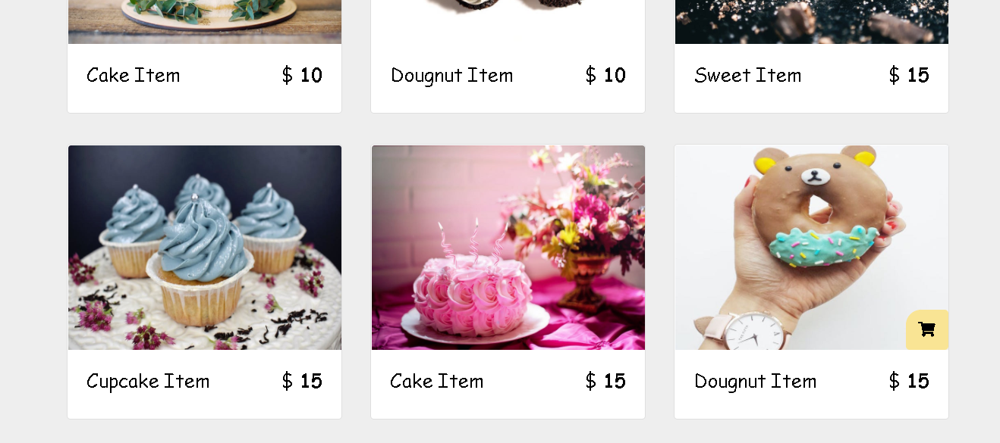

# cart-project-php

Projeto reformulado em php e mysql baseado em um projeto do youtube feito puramente em javascript 

Adicionei algumas coisas novas como busca pelo input, ao clicar no checkout vai para outra pagina exibindo os produtos adicionados etc 

  
  
  

